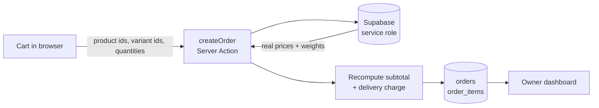

<div align="center">

# 🕯️ Candle Co.

**A premium storefront and owner dashboard for a candle-supplies shop — built for someone who has never seen a terminal.**

[](https://nextjs.org)
[](https://react.dev)
[](https://www.typescriptlang.org)
[](https://tailwindcss.com)
[](https://supabase.com)
[](https://vercel.com)

[**Live site →**](https://candlecowax.com)

</div>

---

## What this is

A complete, production-deployed ecommerce site in two halves:

- **Storefront** — a public shop where customers browse, pick weights, fill a cart and check out.
- **Owner dashboard** — a private admin area where a non-technical owner manages products, photos, categories, weights, prices and orders.

**There is no payment gateway, on purpose.** The owner arranges payment directly with each customer — bKash, Nagad, bank transfer, cash on delivery — and tracks progress through order statuses. No gateway fees, no PCI surface, no chargeback machinery, full control of the money.

---

## Highlights

| | |
|---|---|
| ⚖️ **Per-weight pricing** | One product, many weights, each with its own price. Customers pick a weight; the price updates live. |
| 🚚 **Weight-based delivery** | Charges computed from real cart weight, split by Dhaka zone. Recomputed server-side, never trusted from the client. |
| 🔒 **Row Level Security everywhere** | Public reads see only active products. Every admin write passes an `is_admin()` policy *and* a server-side guard. |
| ⚡ **Edge-cached storefront** | Cookie-less reads make product pages ISR-cacheable — served from cache in ~0.14s, revalidated on every owner edit. |
| 🖼️ **AVIF/WebP pipeline** | Automatic modern formats through `next/image` — measured 20.9 KB JPEG → 2.6 KB AVIF (−87%). |
| 📦 **Self-correcting stock** | Inventory moves exactly once when an order completes, and unwinds cleanly if the status is reversed. |
| 💬 **WhatsApp ordering** | Every product, the cart and checkout can hand off to a prefilled WhatsApp chat. Hidden until a number is configured. |
| 🧑‍🦯 **Built for a non-dev** | Native `<select>`s and checkboxes over clever widgets, plain-language errors, and a full written owner's manual. |

---

## Features

<details open>
<summary><b>Storefront</b></summary>

- Home page with hero, value props and a live featured grid
- Product catalog with category filter and search
- Product detail pages — gallery, weight selector with live pricing, quantity, stock state, SEO metadata
- Weight-picker dialog when adding to cart straight from a listing card
- Persistent cart (survives refresh) with per-weight line items
- Delivery-zone picker showing what each zone would cost
- Guest checkout — validated form → server action → order in the dashboard
- "Order on WhatsApp" at every step, with the cart prefilled into the message
- Graceful empty states when the database isn't connected yet

</details>

<details open>
<summary><b>Owner dashboard</b></summary>

- Supabase Auth login with an admin-role guard on every route and action
- Product CRUD with drag-free multi-image upload to Supabase Storage
- Weight options editor — add sizes in g or kg, each with its own price
- Category management (create / edit / delete inline)
- Order list and detail — items, chosen weights, delivery breakdown, customer info
- One-tap "Message on WhatsApp" with the order number prefilled
- Status pipeline with automatic stock movement
- Overview stats — products, orders, pending, revenue

</details>

---

## Delivery pricing

The customer picks a zone at checkout; the charge is derived from total cart weight and billed **per started kilogram** (2.4 kg bills as 3 kg).

| Total weight | Inside Dhaka | Outside Dhaka |
|---|---:|---:|
| Up to 1 kg | ৳70 | ৳130 |
| Up to 2 kg | ৳90 | ৳150 |
| Each extra kg | +৳20 | +৳20 |
| *Nothing sold by weight* | ৳70 | ৳110 |

Products without weight options carry no weight, so a cart made only of those falls back to the flat minimum. The whole rate table lives in one file — [`src/lib/delivery.ts`](src/lib/delivery.ts) — and is imported by both the UI and the order action, so the number shown is always the number charged.

---

## Tech stack

| Layer | Choice | Why |
|---|---|---|
| Framework | **Next.js 16** (App Router) | Server Actions, ISR, and a single deployable |
| Language | **TypeScript 5** | One `src/lib/types.ts` mirrors the DB schema |
| UI | **React 19** + **Tailwind CSS v4** | — |
| Components | **shadcn/ui** (`base-nova`, on **Base UI**) | Accessible primitives; uses `render`, not `asChild` |
| Database | **Supabase Postgres** | Managed Postgres with RLS built in |
| Auth | **Supabase Auth** | Owner login; customers stay guests |
| Files | **Supabase Storage** | Public bucket, writes via service role only |
| State | **zustand** + `persist` | Cart survives reloads, versioned migrations |
| Forms | **react-hook-form** + **zod 4** | Same schemas validate on client *and* server |
| Icons / toasts | **lucide-react** · **sonner** | — |
| Hosting | **Vercel** | Deployed by CLI, no Git integration required |

> Deliberately host-agnostic — nothing here is locked to Vercel-only services, so it can move to any Node host.

---

## Architecture

### Three Supabase clients, three jobs

Picking the wrong client is the easiest way to leak data or kill caching, so they're separated by intent:

| Client | Key | Used by | Why it exists |
|---|---|---|---|
| `supabase/public.ts` | anon, **cookie-less** | Storefront reads | Touching cookies forces dynamic rendering. This one doesn't, so pages stay ISR-cacheable. RLS still restricts it to active products. |
| `supabase/server.ts` | anon, cookie-aware | Dashboard reads | Needs the session to resolve the logged-in owner. |
| `supabase/admin.ts` | **service role** | Server Actions only | Bypasses RLS. `import "server-only"` and an admin guard keep it off the client. |

### Trust boundary

The client is never believed about money.



The browser sends *what* was ordered — ids and quantities. It never sends prices. `createOrder` re-reads every product, resolves the chosen weight option, recomputes the subtotal and the delivery charge from the server-side rate table, and rejects any line whose weight no longer exists. A tampered cart cannot change a total.

### Caching strategy

- Storefront pages set `revalidate = 300` and product pages pre-render via `generateStaticParams()`
- Admin writes call `revalidatePath()`, so owner edits appear immediately instead of waiting out the window
- Middleware is scoped to `matcher: ["/admin/:path*"]` — this removed a Supabase auth round-trip from *every* public request
- Images cache for a year with AVIF/WebP negotiation

### Stock lifecycle

Stock moves on exactly one transition: **entering `completed` deducts, leaving `completed` restores.** The invariant is "a completed order equals exactly one deduction," so toggling a status can never double-count. Deductions clamp at zero — for a manual-fulfilment shop, a soft counter beats a hard error at 2 a.m.

---

## Getting started

**Prerequisites** — Node.js 20.9+, npm, and a free [Supabase](https://supabase.com) project.

```bash
# 1. Install
npm install

# 2. Configure
cp .env.example .env.local     # then fill in the values below

# 3. Create the schema
#    Supabase Dashboard → SQL Editor → paste & run, in order:
#      supabase/schema.sql
#      supabase/migrations/*.sql

# 4. (Optional) Seed demo products and images
node --env-file=.env.local scripts/seed.mjs

# 5. Run
npm run dev                    # → http://localhost:3000
```

### Environment variables

| Variable | Required | Notes |
|---|:--:|---|
| `NEXT_PUBLIC_SUPABASE_URL` | ✅ | Project Settings → API |
| `NEXT_PUBLIC_SUPABASE_ANON_KEY` | ✅ | Safe in the browser; RLS constrains it |
| `SUPABASE_SERVICE_ROLE_KEY` | ✅ | **Server-only. Bypasses RLS. Never expose it.** |
| `NEXT_PUBLIC_SITE_NAME` | — | Defaults to `Candle Co.` |
| `NEXT_PUBLIC_CURRENCY` | — | ISO code, defaults to `BDT` |
| `NEXT_PUBLIC_LOCALE` | — | Defaults to `en-BD` |
| `NEXT_PUBLIC_WHATSAPP_NUMBER` | — | Digits only, no `+`. WhatsApp buttons stay hidden until set |
| `NEXT_PUBLIC_WHATSAPP_COUNTRY_CODE` | — | Expands local numbers, defaults to `880` |

`.env.local` is gitignored and must never be committed.

### Creating the owner account

1. Supabase → **Authentication → Users → Add user** (email + password, confirmed).
2. Supabase → **SQL Editor**:
   ```sql
   update public.profiles set role = 'admin'
   where id = (select id from auth.users where email = 'owner@example.com');
   ```
3. Sign in at `/admin/login`.

---

## Project structure

```
src/
├── app/
│   ├── (storefront)/            # public site — home, products, cart, checkout
│   ├── admin/
│   │   ├── login/               # owner sign-in
│   │   └── (dashboard)/         # guarded group: products, categories, orders
│   ├── actions/orders.ts        # public createOrder (price + delivery recompute)
│   └── layout.tsx
├── components/
│   ├── ui/                      # shadcn/ui primitives (Base UI)
│   ├── storefront/              # cards, cart, checkout, weight & zone pickers
│   └── admin/                   # product form, category manager, order controls
└── lib/
    ├── actions/                 # admin Server Actions, all requireAdmin-guarded
    ├── data/                    # read layer (public + admin)
    ├── supabase/                # the three clients + config + middleware
    ├── store/cart.ts            # zustand cart, persisted & versioned
    ├── validations/             # zod schemas shared by client and server
    ├── delivery.ts              # single source of truth for delivery rates
    ├── product.ts               # weight-option helpers
    └── types.ts                 # domain types mirroring the DB
supabase/
├── schema.sql                   # tables, triggers, RLS, storage bucket
├── migrations/                  # incremental, additive, safe to re-run
└── seed.sql
scripts/seed.mjs                 # uploads sample images + upserts demo data
```

---

## Data model

```
profiles ──< orders ──< order_items >── products >── categories
   │                                        │
   └─ role: customer | admin                └─ variants: jsonb weight options
```

- **`products.variants`** — `[{ id, label, weight_kg, price }]`. Empty means a single-price product. `products.price` mirrors the cheapest option so listings and sorting keep working.
- **`orders`** — carries `delivery_zone`, `delivery_charge`, `total_weight_kg` alongside `subtotal` and `total`.
- **`order_items`** — snapshots `product_name`, `variant_label`, `weight_kg` and `unit_price` at purchase time, so history stays truthful when prices change later.
- **Order statuses** — `pending → confirmed → paid → shipped → completed`, plus `cancelled`.

Migrations are additive and idempotent (`add column if not exists`), so they're safe to re-run against a live database.

---

## Deployment

```bash
npx vercel --prod
```

Set every environment variable in the Vercel project first — the build needs the `NEXT_PUBLIC_*` ones baked in. Apply any pending SQL migration **before** deploying code that depends on it.

---

## Scripts

| Command | What it does |
|---|---|
| `npm run dev` | Dev server with Turbopack |
| `npm run build` | Production build |
| `npm start` | Serve the production build |
| `npm run lint` | ESLint |
| `npx tsc --noEmit` | Type-check without emitting |

---

## Security notes

- The service-role key is server-only and gated behind `import "server-only"` plus `requireAdmin()` on every action.
- RLS is enabled on all five tables; public users can read active products and categories, and nothing else.
- Orders are inserted by a trusted Server Action, so `orders` needs no public insert policy.
- Prices, weights and delivery charges are always recomputed server-side.
- Image uploads are capped at 8 MB and stored under generated UUID paths.

---

## Roadmap

- [ ] Optional customer accounts — saved addresses and order history
- [ ] Per-weight stock instead of a shared product counter
- [ ] Custom category cover images in the dashboard
- [ ] Sitemap, OG images and richer structured data
- [ ] Order confirmation emails

---

<div align="center">

Built with care for a real shop. 🕯️

</div>
